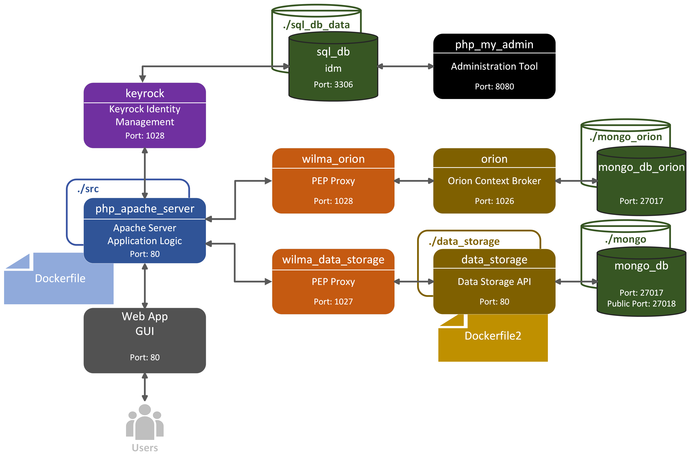

# Cloud-Fog-Computing-2022
A client-server, service oriented imaginary e-shop project.
  
  This project is using JavaScript (JQuery/AJAX requests) for client-side operations, PHP for server-side operations and Docker for virtualization. MongoDB NoSQL databases are being used. The three key services used in the project are developed by [FIWARE](https://www.fiware.org/);  
  + [Keyrock](https://fiware-idm.readthedocs.io/en/latest/) as an identity management
  + [Orion Context Broker](https://fiware-orion.readthedocs.io/en/master/) as a PUB-SUB service
  + [PEP Proxy - Wilma](https://fiware-pep-proxy.readthedocs.io/en/latest/) as a proxy

------------

## E-shop Utilities

The e-shop has five basic types of entities:

+ Products  
+ Users
	+ Users (customers)
	+ Product Sellers
	+ Admins
+ Cart items
+ Subscriptions
+ Notifications

#### Products
Products are items that product sellers create and users(customers) can either add to their cart or subscribe to them to get notifications. The products provided have been sourced from a database found on [kaggle.com](https://www.kaggle.com/).
#### Users
The users are clients who own an account in the e-shop. A new user can be registered on the sign up page and can login on the index page. Each user has one of three roles: user(customer), product seller or admin. Users (customers) can add products to their cart or subscribe to products to get notifications about them. Product sellers can create/edit/delete products. Admins can accept/edit/delete users.
#### Cart items
Each user(customer) has a cart where they can add/remove products.
#### Subscriptions
Each user(customer) can subscribe to a product in order to receive notifications when changes to the said product occur. 
#### Notifications
Notification items are created automatically when a change is made on a product and they are personalized to every subscribed user to that product.

## Services

